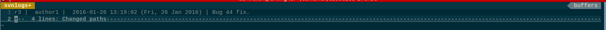

## vimsvn

vimsvn script is developed for interacting with svn logs (history). It uses vim for displaying all information as frontend on Linux.

## Motivation

For accessing repo history, current option is 'svn log' command at terminal based system. Now, its upto developer to find out required version and print its further information. The process is bit cumbersome for me, so I developed this script.

## Installation

Put this script at any location (preferably ~/.local) and append path till 'bin' in PATH variable.
To work this script, vim should be compiled with cleantserver and python3 option.

Please note that this script is tested on lubuntu on Virtualbox where target machine was SSHed with -X flag.

## Uses

run vimsvn command.

It will load the svn history of current folder. If you want to see history of some perticular file, give path as follow:
vimsvn "./test1.c"

It will start displaying as follow:

Now, expand/fold folded lines using 'sc'. Move cursor to the file, for which you want to see the diff with previous version. press 'sd'. This will open diff in new tab. Use ':tabclose' or 'sa' to close tab.

## Vim Bindings

**sc** -> Behaves like 'za'

**sd** -> Shows diff of file with previous version.

**sa** -> behaves like ':tabclose'

## Improvements

1. Currently this script uses 'vim --server' option. For '--server' option, XSERVER needs to be configured. This is not a problem for me as I uses Linux at Virtual Machine and SSH the target machine with -X flag, which exports the DISPLAY of target machine to host machine. This means if no XSERVER is configured (using cygwin or others) using putty, this script will not work.
    >>> As a improvement, instead of --server option, if the vim reference can be passed to diff script, the content can be set from python easily.

## Bugs

Please mail me at 'varshneyabhi@gmail.com'

## License

Will be updated.
